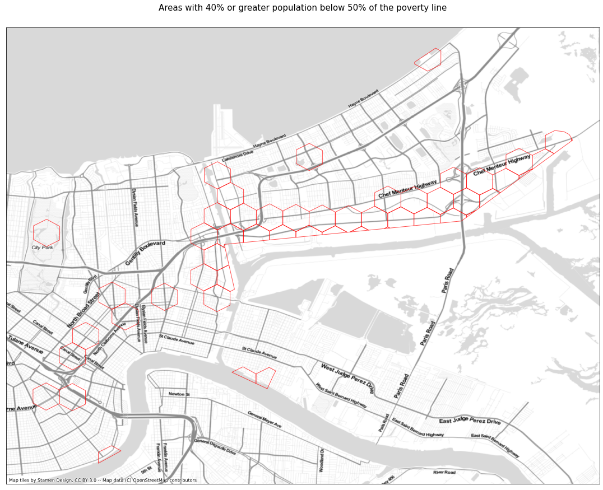
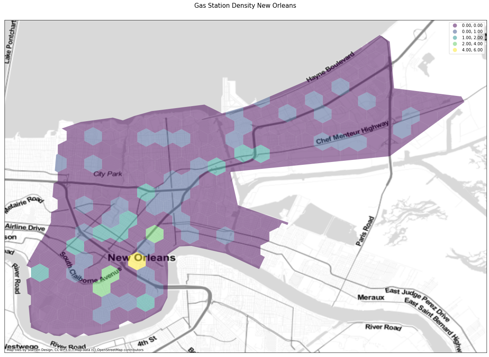
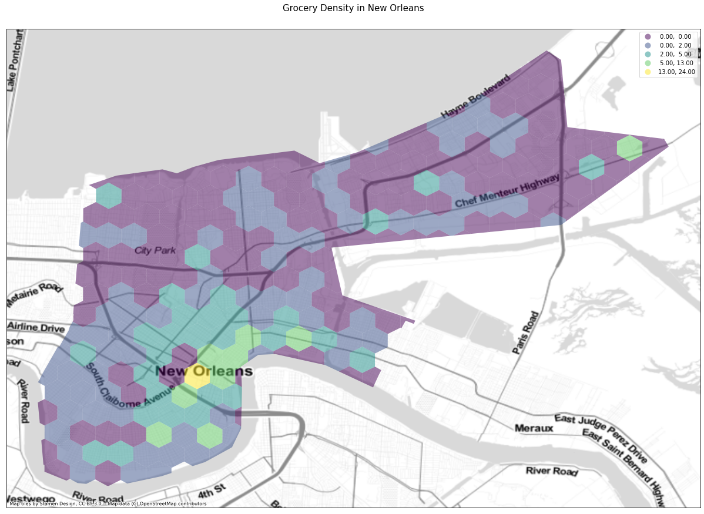
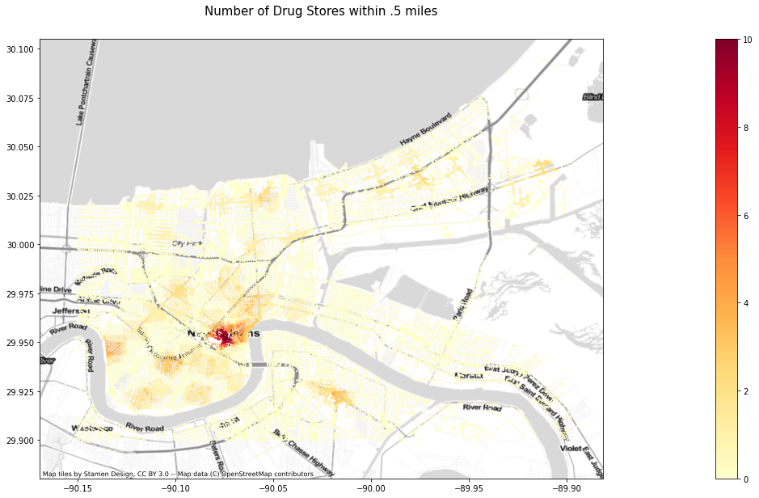
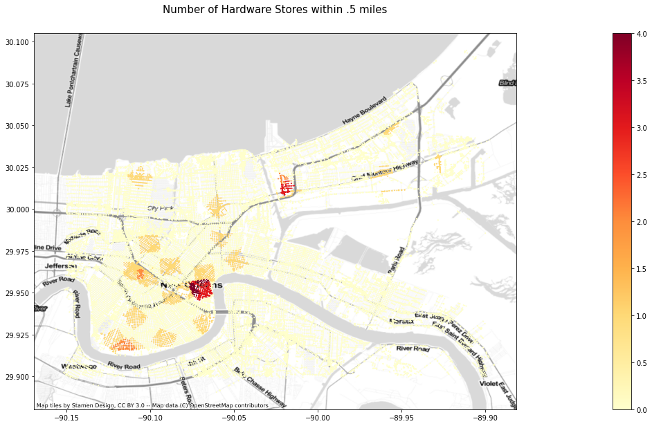
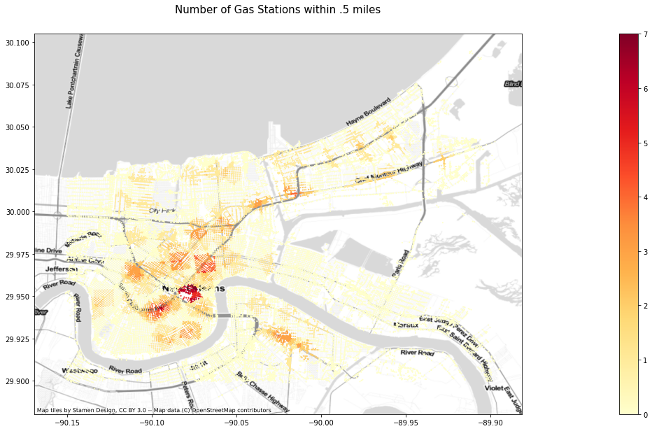
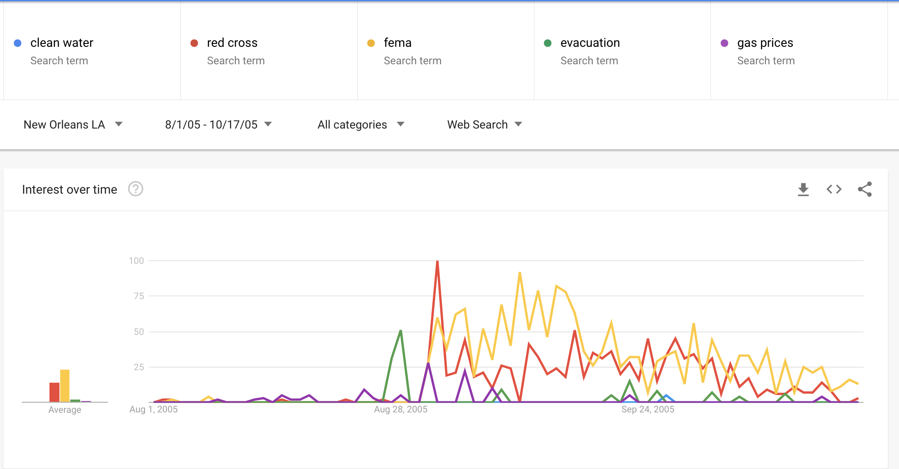

# Assessing community-needs gaps for resilience hubs in New Orleans

## Research question:
_What are the remaining gaps in emergency & resilience services that communities need in post-Katrina New Orleans?_

In this project we’re looking at access to different emergency resources in New Orleans neighborhoods as a way of showing disparities between high-income, high resource communities and low-income, low-resource communities (and those in between). By focusing on specific service centers like grocery stores, hospitals, and school, which are incredibly important during and following a natural disaster, we hope to show the need for disaster service hubs in underserved areas, as well as what types of services are missing and where might be the most effective location for them. We looked at the overlap of income and resource availability as well building out network maps for the areas most and least accessible to particular emergency-related services (as well as services broadly).

While the research question itself was fairly straightforward, finding the right data and validating it with actual human behavior is incredibly complex. That is, just because we are mapping grocery stores, doesn't mean that is where residents may look to for food in emergency situations–it may be a church, a food bank, or something else entirely. There is a fundamental gap between services currently provided, services people think they need, and services people actually need. 
We attempted to address this through google search trends, which proved interesting but largely less helpful than we hoped. Part of this was that the manual nature of searching doesn’t readily take into account how humans think or search. That is, where our food and water proxy is a grocery store, they may search for “bottled water”, “relief”, or “FEMA” rather than “grocery store”. This will necessitate some assumptions on our part in interpreting indirectly-related searches, in that “bottled water” should likely signify simply needing clean water, not a specific desire for bottled water per se. We had hoped to validate our map data findings against essentially consumer behavior and the ways New Orleans residents were searching for services, but this did not bear fruit. Given the different between what our maps show people need and what people seem to think they need through common searches, it is also important to note that this may validate a different need to do flood and hurricane education, lest residents’ understanding be detached from reality. 

In comparing what people actually have access to and what they actually want (or think they need) access to, we can attempt to bridge the gap between institutions and communities in easily actionable ways. 

## Research approach:

1. Looking at the access to resources that might be of value in preperation of, during, and following a storm.  
2. Looking at poverty line stats to see double vulnerability.
3. Looking at search trends, which should indicate what people want, what they are concerned about, and what they think they need, even if all three of those points are detached from reality 
4. Show govts where/what they need to be adding infrastructure to support high-risk communities
5. Show gaps in data, gaps in data access, disconnect in ‘human error’ search vs need*

## Specific Methodology:

1. Limit all data to target area by intersecting data sets with GeoJson targetting downtown New Orleans and East New Orleans.
2. Use census data to show percent of population living below 50% of the poverty line and see what neighborhoods may be worth focusing on.
3. Asses recource density through Hexbin maping of individual resources (like hardware stores, or grocery stores)
4. Understand combined resource vulnerability through Hexbin mapping of weighted resource density
5. Understand multiplied vulnerability density through Hexbin mapping of weighted resource density inclusive of poverty metric
6. Network analysis for areas within .5 miles of individual resources
7. etwork analysis for areas within .5 miles of combined resources
8. Manual Google trends for 2005 search terms in New Orleans pre and post-Katrina
9. Manual investigation into peaks and valleys around other similar search term proxies
10. Comparison of manual search trend findings with data analysis* 

### 2. Use census data to show percent of population living below 50% of the poverty line

_2a. Poverty metric by Census Tract_

_This initial map was to highlight places of interest and potential focus given income dispartity and resource disparity. Here we see areas where the population is is at least 50% below the poverty line. What we see in simple terms is that there are small pockets of slightly elevated poverty in the downtown core, with one hotspot in the northeast of the city around the Desire neighborhood._

_2b. Poverty in apx .3 square mile Hexbin_

_Following our hexbin approach to resource, we wanted to match the same for population at least 50% below the poverty line. Here the Desire neighborhood becomes even more pronounced as a place of concern, highlighted in bright yellow. New Orleans East is also shown to be of concern in green._

_2C. High economic vulnerability_

### 3. Assess recource density through Hexbin mapping of individual resources

_3a. Drug Stores (Medicine and First Aid Proxy)_

_Drug stores function as a proxy for medical supplies, and while we still see some concentration of resources in the downtown core, we also see a long corridor of access along the north end of the city. Hospitals and health clinics would have provided a more robust picture of more formal medical access, but this also shows that at a more informal level, of where people might able to or be forced to go for non-life threatening injuries. While not alone, Desire falls into a low access area._

_3b. Hardware Stores (Disaster Preperation)_

_Hardware stores function as a proxy for indicating any amount of building resources, especially for plywood leading up and following hurricanes or tarps and other roof fixes. Given that there are not a huge amount of hardware stores in the city, and that some residents have simply previously purchased hardware-related fixes, we do not see any massive hotspots for hardware store access. Most of them, somewhat unsurprisingly, are concentrated in the downtown areas. While certainly  not alone, Desire falls into a low access area._

_3c. Gas Stations (Evacuation and Energy Preperation)_

_Gas station access was a surprise, not in the density around the downtown core, but that the eastern half of the city–which would ostensibly have the hardest time evacuating by car–has almost no gas stations at all. This will absolutely have downstream effects of further resource access (services you might need a car for), and also for services around small fixes and snacks. While not alone, Desire falls into a low access area._

_3d. Grocery Stores (Food Access)_

_Grocery stores as food access were a much more fruitful place of inquiry and showed resource disparities and hotspots more clearly. The green spot in the northeast of the city shows another “main drag”. Here, Desire’s lack of access is more pronounced, as it surrounded by higher resource access. Grocery stores, certainly food deserts, often are a symptom of much greater disparities._

_3e. Restaurants (Disaster Shelter and Food Access)_

_Restaurants to a certain degree functioned as food-access proxies, knowing that many restaurants remain open, or reopen, as post-hurricane resources (like Waffle House, has become an official measurement of hurricane severity through FEMA). The concentration of restaurants downtown is unsurprising, and the areas outside of it with blue access may also double as “main drags” in those neighborhoods, where other resources may be available. While not alone, Desire falls into a low access area._

### 4. Understand combined resource vulnerability through Hexbin mapping of weighted resource density

_Total combined resources (gross, no weighting)_

_Overall resource density shows a much more nuanced understanding of resource access around downtown and east new orleans. We see higher access in the downtown core in a broad sense, and lower access in the northeast and eastern areas of the city. There is a pronounced lack of resource density just east of the downtown core: Desire neighborhood._

_Weighted Ressource Access_

_Here we have combined resource access with poverty weights added, broadly showing that the downtown core has lots of resources, New Orleans East and Desire are broadly low-income and low-resource, with pockets of the city in transition. A few spots in the east of the city show some promise, but the area directly east and northeast of the downtown core show the most pronounced areas of low-income, low-resource access._

### 5. Understand multiplied vulnerability density through Hexbin mapping of weighted resource density inclusive of poverty metric

_Weighted Resource Vulnerability overlaid with areas where 40% or more of the population live below 50% of the poverty line_

### 6. Network analysis for areas within .5 miles of individual resources

_6a. Drug Stores (Medicine and First Aid Proxy)_

_Through the network analysis of drugstore access, again as some level of medical service access, we see a very obvious hub in eastern downtown with several yellow pockets across thec city, but still predominantly downtown. While this may not show lack of medical access on its face, it does suggest that downtown area and density may have disproportionate effects on resource access._

_6b. Hardware Stores (Disaster Preperation)_

_Through the network analysis of hardware stores, we see that very few areas actually have a 0.5 mile access point for hardware stores, and is mostly heavily visible in the eastern part of the downtown core. There are a few other areas shown in orange and pockets of sparse red, but the obvious concentration is by the riverbend in eastern downtown._

_3c. Gas Stations (Evacuation and Energy Preperation)_

_3d. Grocery Stores (Food Access)_

_3e. Restaurants (Disaster Shelter and Food Access)_

### 7. Network analysis for areas within .5 miles of combined resources

### 8. Manual Google trends for 2005 search terms in New Orleans pre and post-Katrina

Here what we wanted to see was what people were actually searching for in terms of emergency resources, compared to what we thought they might be searching for. Ultimately this was an exercise in nuanced human behavior and how people actually describe what they need in written form, ostensibly as search terms. Because there is no "clean" way of seeing what the top search terms were that year or those months, we had to manually go in and hypothesize how people might actually search for things, and then use the associated search terms to validate what was being sought after. This was not as scientific as we had hoped, but also underscored the need for more obvious search trend data around these themes.

_8a. Search terms around initial data_

### 9. Manual investigation into peaks and valleys around other similar search term proxies

_9a. Search terms around follow-up data_

_Here we see an obvious difference, with search terms clearly spiking in the aftermath of Katrina. These are things people are clearly searching for, and so perhaps it was human error on our part simply not knowing how residents actually describe their needs and concerns._

_9b. Search terms around follow-up data_

_Similarly, we see that “clean water” was the actual term for services associated with grocery stores, “red cross” for medical, and “gas prices” for gas stations. Evacuation and gas prices also go hand in hand, and certainly “FEMA” would reveal much needed relief services across the board._ 

_9c. Search terms around follow-up data_

_Here we see other search terms that started coming to the fore once we "learned" how people were searching for needed services or concerns, and broadly they are looking into the problem, not a service for the solution. That is how they are searching for it, at least. "Roof" not "tarp", "housing" not "shutters", "clean water" not "supermarket" or "filters". We tried to use baseline searches to see what was actually spiking, but we found little consistency. Ultimately each of these simply shows different ways that resident thought to search for services or concerns, but it remains difficult to connect to our actual data analysis of the services offered._

_While we recognize that we used proxies for several services, the natural assumption was that to some degree people would still recognize the proxy variables as helpful enough to search for them directly on google before or after Katrina. However, we see that they did not, in fact, search for any of them. Part of this may be internet access in the wake of the storm, but it also shows that these were not directly tied to broader concerns that would have come up for residents. That is, people are not searching for hardware stores, they are searching for ‘roof’ or ‘blue roof’ (blue tarps that go over damaged roofs); they are not searching for grocery stores, they are searching for “clean water”. What this shows on its face is that there is a clear disconnect in services technically available, services people may want, and how they might characterize the services they need or seek out._

### 10. Comparison of manual search trend findings with data analysis* 

_10a. Composite data analysis compared to intial search terms_

### ANDREW PUT THE FINAL COMPOSITE DATA ANALYSIS HERE

_Seeing these two side by side is specifically to note their lack of compatibility for comparison. Here we see all the resources we mapped and analyzed compared to the search results for those specific resources. We see a giant gap, because nobody was searching for them as written. This shows that there is a gap that clearly needs to be addressed between services offered and services sought out._

_10b. Composite data analysis compared to follow-up search terms_

### ANDREW PUT THE FINAL COMPOSITE DATA ANALYSIS HERE AGAIN

_Here we present an_  **equally** _unusable and incompatible comparison in that on the right, we see commonly used search terms, and so it would have been beneficial to map those more specific services, needs, or remedies. Instead, we were only able to showcase terms that are not specifically being searched for. What this shows, among other things, is the need for different data that we can map, deeper search trend data, and a bridge for the resource access that connects the two of them. There cannot exist such an obvious data access gap for needed emergency services._

### 5. Understand multiplied vulnerability density through Hexbin mapping of weighted resource density inclusive of poverty metric

## Summary of Findings:

Our findings show a few obvious points, but broadly need to be taken with the caveat that this research was done with a limited set of data that may not effectively account for all the proxies that represent local needs. For example, we were not able to access data for church locations or non-hospital health clinics, which might skew what looks like access. Just as well, we did not map against elevation, which might influence how quickly some of the needed services might be rendered inaccessible.

What we find is that downtown New Orleans is the best suited given its density of services, and that the lower 9th ward, pushing east and heavily exposed, is broadly the worst off in terms of service accessibility. Physical, social, and economic vulnerability overlap in very clear ways, showing that high-income indicates high-access and vice versa. The Desire neighborhood in particular, however, is the most acute example of lowest-income and lowest-resource. Once identified, we did research around Desire, and found that it has recently been recognized as one of the most dangerous neighborhoods in the country, and so such accessibility to services as mentioned is both unsurprising and deeply difficult to remedy.

While it makes little sense to argue for either implementation of services where they will not be used or abandonment of an already vulnerable neighborhood, this potentially reveals opportunities to offer more services on the periphery of Desire. This should also drive home the point of the need for service access and hubs for multiple services around several other neighborhoods, particularly those that are more exposed to flood-risk and have less recourse should emergencies occur (downtown New Orleans has easy access to multiple neighborhoods outside of the bowl, where Desire and the lower 9th have to go through the most flood-prone areas just to get out). 

_*The lack of access to more in-depth search data combined with caveats around lack of more specific data around resources people actually use in time of need (like churches) rather than the assumed/traditional places like grocery stores also presents a clear need for the NOLA GIS team to take a more community-focused approach to its data and data availability, such that its services might be more equitable and more reflective of local needs._

