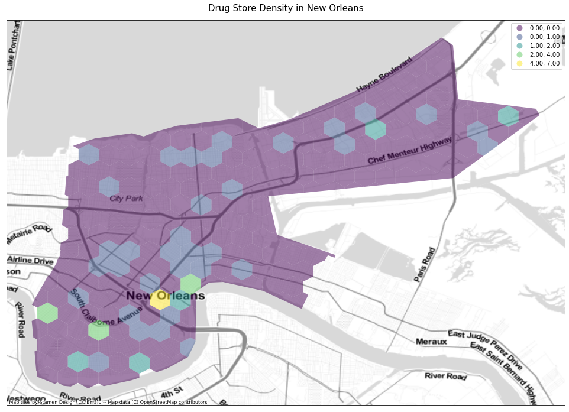

# Assessing community-needs gaps for resilience hubs in New Orleans

## Research question:
_What are the remaining gaps in emergency & resilience services that communities need in post-Katrina New Orleans?_

In this project we’re looking at access to different emergency resources in New Orleans neighborhoods as a way of showing disparities between high-income, high resource communities and low-income, low-resource communities (and those in between). By focusing on specific service centers like grocery stores, hospitals, and school, which are incredibly important during and following a natural disaster, we hope to show the need for disaster service hubs in underserved areas, as well as what types of services are missing and where might be the most effective location for them. We looked at the overlap of income and resource availability as well building out network maps for the areas most and least accessible to particular emergency-related services (as well as services broadly).

While the research question itself was fairly straightforward, finding the right data and validating it with actual human behavior is incredibly complex. That is, just because we are mapping grocery stores, doesn't mean that is where residents may look to for food in emergency situations–it may be a church, a food bank, or something else entirely. There is a fundamental gap between services currently provided, services people think they need, and services people actually need. 
We attempted to address this through google search trends, which proved interesting but largely less helpful than we hoped. Part of this was that the manual nature of searching doesn’t readily take into account how humans think or search. That is, where our food and water proxy is a grocery store, they may search for “bottled water”, “relief”, or “FEMA” rather than “grocery store”. This will necessitate some assumptions on our part in interpreting indirectly-related searches, in that “bottled water” should likely signify simply needing clean water, not a specific desire for bottled water per se. We had hoped to validate our map data findings against essentially consumer behavior and the ways New Orleans residents were searching for services, but this did not bear fruit. Given the different between what our maps show people need and what people seem to think they need through common searches, it is also important to note that this may validate a different need to do flood and hurricane education, lest residents’ understanding be detached from reality. 

In comparing what people actually have access to and what they actually want (or think they need) access to, we can attempt to bridge the gap between institutions and communities in easily actionable ways. 

## Research approach:

1. Looking at the access to resources that might be of value in preperation of, during, and following a storm.  
2. Looking at poverty line stats to see double vulnerability.
3. Looking at search trends, which should indicate what people want, what they are concerned about, and what they think they need, even if all three of those points are detached from reality 
4. Show govts where/what they need to be adding infrastructure to support high-risk communities
5. Show gaps in data, gaps in data access, disconnect in ‘human error’ search vs need*

## Specific Methodology:

1. Limit all data to target area by intersecting data sets with GeoJson targetting downtown New Orleans and East New Orleans.
2. Use census data to show percent of population living below 50% of the poverty line and see what neighborhoods may be worth focusing on.
3. Asses recource density through Hexbin maping of individual resources (like hardware stores, or grocery stores)
4. Understand combined resource vulnerability through Hexbin mapping of weighted resource density
5. Understand multiplied vulnerability density through Hexbin mapping of weighted resource density inclusive of poverty metric
6. Network analysis for areas within .5 miles of individual resources
7. etwork analysis for areas within .5 miles of combined resources
8. Manual Google trends for 2005 search terms in New Orleans pre and post-Katrina
9. Manual investigation into peaks and valleys around other similar search term proxies
10. Comparison of manual search trend findings with data analysis* 

### 2. Use census data to show percent of population living below 50% of the poverty line

### 3. Asses recource density through Hexbin maping of individual resources

_2a. Drug Stores (Medicine and First Aid Proxy)_

_2b. Hardware Stores (Disaster Preperation)_

_2c. Gas Stations (Evacuation and Energy Preperation)_

_2d. Grocery Stores (Food Access)_

_2e. Restaurants (Disaster Shelter and Food Access)_

### 4. Understand combined resource vulnerability through Hexbin mapping of weighted resource density

_Total combined resources (gross, no weighting)_

_Weighted Ressource Access_

## Summary of Findings:

Our findings show a few obvious points, but broadly need to be taken with the caveat that this research was done with a limited set of data that may not effectively account for all the proxies that represent local needs. For example, we were not able to access data for church locations or non-hospital health clinics, which might skew what looks like access. Just as well, we did not map against elevation, which might influence how quickly some of the needed services might be rendered inaccessible.

What we find is that downtown New Orleans is the best suited given its density of services, and that the lower 9th ward, pushing east and heavily exposed, is broadly the worst off in terms of service accessibility. Physical, social, and economic vulnerability overlap in very clear ways, showing that high-income indicates high-access and vice versa. The Desire neighborhood in particular, however, is the most acute example of lowest-income and lowest-resource. Once identified, we did research around Desire, and found that it has recently been recognized as one of the most dangerous neighborhoods in the country, and so such accessibility to services as mentioned is both unsurprising and deeply difficult to remedy.

While it makes little sense to argue for either implementation of services where they will not be used or abandonment of an already vulnerable neighborhood, this potentially reveals opportunities to offer more services on the periphery of Desire. This should also drive home the point of the need for service access and hubs for multiple services around several other neighborhoods, particularly those that are more exposed to flood-risk and have less recourse should emergencies occur (downtown New Orleans has easy access to multiple neighborhoods outside of the bowl, where Desire and the lower 9th have to go through the most flood-prone areas just to get out). 

_*The lack of access to more in-depth search data combined with caveats around lack of more specific data around resources people actually use in time of need (like churches) rather than the assumed/traditional places like grocery stores also presents a clear need for the NOLA GIS team to take a more community-focused approach to its data and data availability, such that its services might be more equitable and more reflective of local needs._

